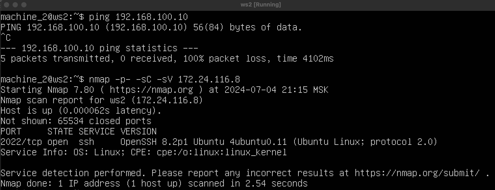
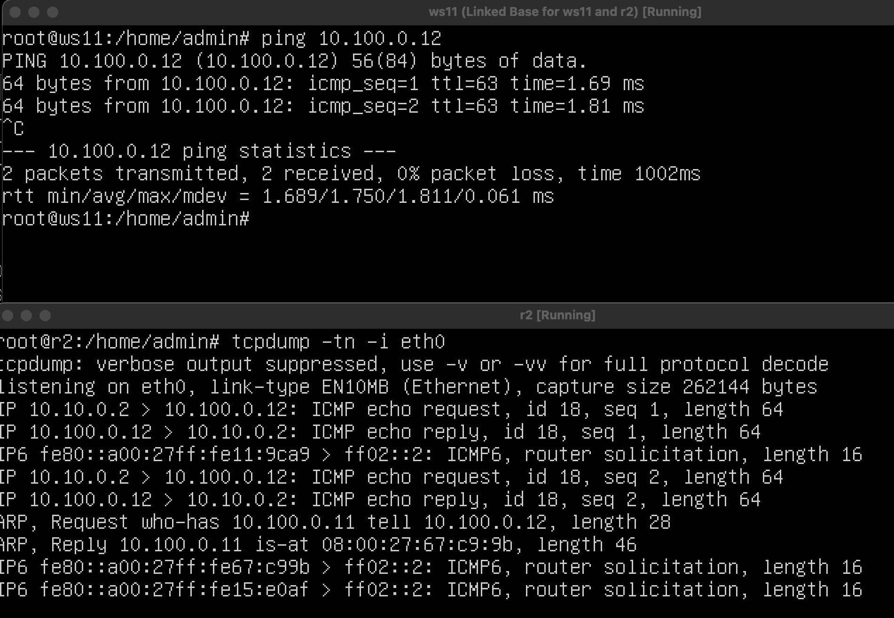
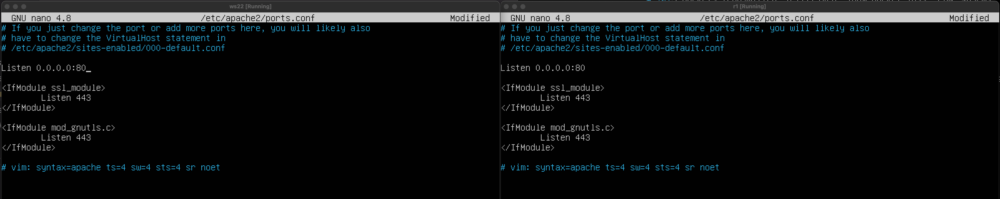
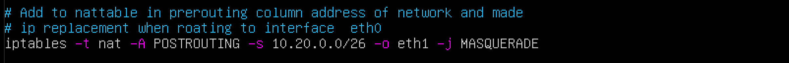
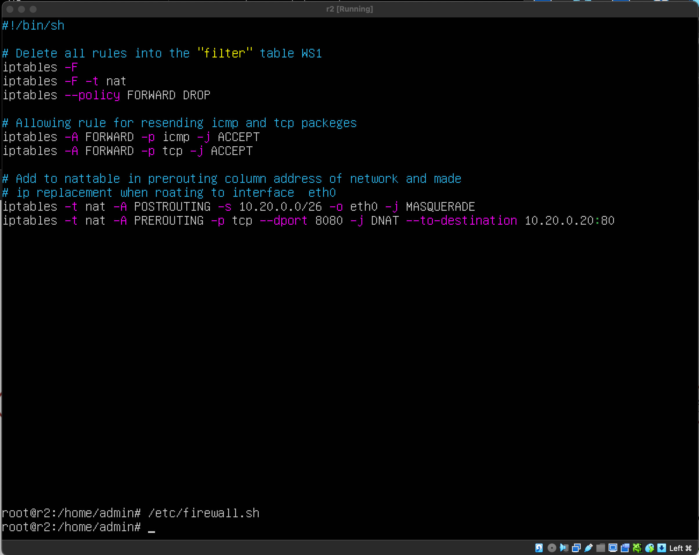
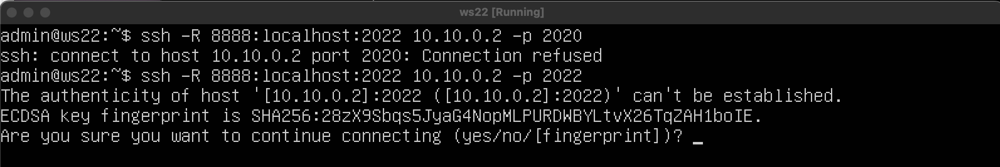

# Сети в Linux

## Part 1. Инструмент **ipcalc** 
`-` Итак, начнём наше погружение в удивительный мир сетей со знакомства с IP адресами. А использовать для этого мы будем инструмент **ipcalc**.


#### Поднимим ws11

конировали

---
#### Накатим ИП кальк предварительно апдейтнув apt либу


---
#### 1.1. Сети и маски
##### Определи и запиши в отчёт:
##### 1) Адрес сети *192.167.38.54/13*


---
##### 2) Перевод маски *255.255.255.0* в префиксную (24 синее) и двоичную запись,(красное)


---
*/15* в обычную и двоичную, 


---
*11111111.11111111.11111111.11110000* в обычную и префиксную ipcalc выдает ошибку маски
В двоичную форму адреса передать на вход ipcalc нельзя - сказано в materials


---
##### 3) Минимальный и максимальный хост в сети *12.167.38.4* при масках: */8*
,

---
 *11111111.11111111.00000000.00000000*
эту нельзя :(

---


*255.255.254.0* и */4*

---

#### 1.2. localhost
##### Определи и запиши в отчёт, можно ли обратиться к приложению, работающему на localhost, со следующими IP: *194.34.23.100*, *127.0.0.2*, *127.1.0.1*, *128.0.0.1*


Вот к эти можно
*127.0.0.2*, *127.1.0.1*

--- 
#### 1.3. Диапазоны и сегменты сетей
##### Определи и запиши в отчёт:
##### 1) Какие из перечисленных IP можно использовать в качестве публичного, а какие только в качестве частных: *10.0.0.45*, *134.43.0.2*, *192.168.4.2*, *172.20.250.4*, *172.0.2.1*, *192.172.0.1*, *172.68.0.2*, *172.16.255.255*, *10.10.10.10*, *192.169.168.1*
Согласно RFC 1918, существуют следующие диапазоны частных IP-адресов:
10.0.0.0 - 10.255.255.255 (сеть класса A)
172.16.0.0 - 172.31.255.255 (сеть класса B)
192.168.0.0 - 192.168.255.255 (сеть класса C)

IP-адреса 10.0.0.45, 192.168.4.2, 172.20.250.4, 172.16.255.255 и 10.10.10.10 относятся к частным сетям.
IP-адреса 134.43.0.2, 172.0.2.1, 192.172.0.1, 172.68.0.2 и 192.169.168.1 относятся к публичным сетям.

То есть если в какой-то части адреса мы вылезаем за диапозон - то это пабликщит :)

И оказывается можно было прогнать все адреса через ипкалкыча 


---

##### 2) Какие из перечисленных IP адресов шлюза возможны у сети *10.10.0.0/18*: *10.0.0.1*, *10.10.0.2*, *10.10.10.10*, *10.10.100.1*, *10.10.1.255*

Cмотрим:
- 10.0.0.1 нет он меньше диапозона
- 10.10.0.2 да он в диапозоне
- 10.10.10.10 да он в диапозоне
- 10.10.100.1 нет он больше диапозона
- 10.10.1.255 я не уверен на счет этого но вроде лежит типа как широковещательный

---

## Part 2. Статическая маршрутизация между двумя машинами

`-` Теперь разберёмся, как связать две машины, используя статическую маршрутизацию.

##### Подними две виртуальные машины (далее -- ws1 и ws2).

##### С помощью команды `ip a` посмотри существующие сетевые интерфейсы.

##### Опиши сетевой интерфейс, соответствующий внутренней сети, на обеих машинах и задать следующие адреса и маски: ws1 - *192.168.100.10*, маска */16*, ws2 - *172.24.116.8*, маска */12*.
- В отчёт помести скрины с содержанием изменённого файла *etc/netplan/00-installer-config.yaml* для каждой машины.

##### Выполни команду `netplan apply` для перезапуска сервиса сети.

---


#### 2.1. Добавление статического маршрута вручную
##### Добавь статический маршрут от одной машины до другой и обратно при помощи команды вида `ip r add`.


##### Пропингуй соединение между машинами.

Тут стоит внести ремарку что нихрена блин не работало и пришлось копаться в настройках сетевых интерфейсов вибокса


---

#### 2.2. Добавление статического маршрута с сохранением
##### Перезапусти машины.
##### Добавь статический маршрут от одной машины до другой с помощью файла */etc/netplan/00-installer-config.yaml*.

- В отчёт помести скрин с содержанием изменённого файла */etc/netplan/00-installer-config.yaml*.
##### Пропингуй соединение между машинами.
- В отчёт помести скрин с вызовом и выводом использованной команды.


## Part 3. Утилита **iperf3**

Тут нас решили затролить - потому что в локальной сети которую мы настроили отвалился интернет. пришлось снова менять yaml и конфиг сетей вибокса на NAT

#### 3.1. Скорость соединения
##### Переведи и запиши в отчёт: 8 Mbps в MB/s, 100 MB/s в Kbps, 1 Gbps в Mbps.

1. 8 Mbps в MB/s:
   - 8 Mbps (мегабиты в секунду) = 1 MB/s (мегабайт в секунду)
   - Отчет: 8 Mbps = 1 MB/s

2. 100 MB/s в Kbps:
   - 100 MB/s (мегабайт в секунду) = 819200 Kbps (килобиты в секунду)
   - Отчет: 100 MB/s = 819200 Kbps

3. 1 Gbps в Mbps:
   - 1 Gbps (гигабиты в секунду) = 1024 Mbps (мегабиты в секунду)
   - Отчет: 1 Gbps = 1024 Mbpsb n
#### 3.2. Утилита **iperf3**
##### Измерь скорость соединения между ws1 и ws2.


---

## Part 4. Сетевой экран

*В данном задании используются виртуальные машины ws1 и ws2 из Части 2*

#### 4.1. Утилита **iptables**
##### Создай файл */etc/firewall.sh*, имитирующий фаерволл, на ws1 и ws2:
```shell
#!/bin/sh

# Удаление всех правил в таблице «filter» (по-умолчанию).
iptables -F
iptables -X
```
##### Нужно добавить в файл подряд следующие правила:
##### 1) На ws1 примени стратегию, когда в начале пишется запрещающее правило, а в конце пишется разрешающее правило (это касается пунктов 4 и 5).
##### 2) На ws2 примени стратегию, когда в начале пишется разрешающее правило, а в конце пишется запрещающее правило (это касается пунктов 4 и 5).
##### 3) Открой на машинах доступ для порта 22 (ssh) и порта 80 (http).
##### 4) Запрети *echo reply* (машина не должна «пинговаться», т.е. должна быть блокировка на OUTPUT).
##### 5) Разреши *echo reply* (машина должна «пинговаться»).

##### Запусти файлы на обеих машинах командами `chmod +x /etc/firewall.sh` и `/etc/firewall.sh`.
Пояснение: 
- При попытке пингануть первую машину в ответ будет тишина так как у нее сначала прописан запред на icmp, ws2 пингуется без проблем. Ну а все что наразрешали разрешино по умлчанию и не имеет смысла. Ткни меня в место где я ошибаюсь - если я не прав.=)

#### 4.2. Утилита **nmap**
##### Командой **ping** найди машину, которая не «пингуется», после чего утилитой **nmap** покажи, что хост машины запущен.
*Проверка: в выводе nmap должно быть сказано: `Host is up`*.


--- 

##### Сохранил дампы образов виртуальных машин
Будем надеятся это оно:


--- 

## Part 5. Статическая маршрутизация сети

##### Подними пять виртуальных машин (3 рабочие станции (ws11, ws21, ws22) и 2 роутера (r1, r2)).

#### 5.1. Настройка адресов машин
##### Настрой конфигурации машин в *etc/netplan/00-installer-config.yaml* согласно сети на рисунке.
WS11

R1

WS21

WS22

R2

##### Перезапусти сервис сети sudo systemctl restart systemd-networkd. Если ошибок нет, то командой `ip -4 a` проверь, что адрес машины задан верно. Также пропингуй ws22 с ws21. Аналогично пропингуй r1 с ws11.

пингую r1 с ws11.

пингую ws22 с ws21


---

#### 5.2. Включение переадресации IP-адресов
##### Для включения переадресации IP, выполни команду на роутерах:

##### Открой файл */etc/sysctl.conf* и добавь в него следующую строку:
`net.ipv4.ip_forward = 1`
IP-переадресация включена на постоянной основе.

#### 5.3. Установка маршрута по-умолчанию
Пример вывода команды `ip r` после добавления шлюза:
```
default via 10.10.0.1 dev eth0
10.10.0.0/18 dev eth0 proto kernel scope link src 10.10.0.2
```
##### Настрой маршрут по-умолчанию (шлюз) для рабочих станций. Для этого добавь `default` перед IP роутера в файле конфигураций.
WS11:

WS21:

WS22:

##### Вызови `ip r` и покажи, что добавился маршрут в таблицу маршрутизации.
WS11:

WS21:

WS22:

##### Пропингуй с ws11 роутер r2 и покажи на r2, что пинг доходит. Для этого используй команду: `tcpdump -tn -i eth0`



---

#### 5.4. Добавление статических маршрутов
##### Добавь в роутеры r1 и r2 статические маршруты в файле конфигураций. Пример для r1 маршрута в сетку 10.20.0.0/26:
```shell
# Добавь в конец описания сетевого интерфейса eth1:
- to: 10.20.0.0
  via: 10.100.0.12
```
- В отчёт помести скрины с содержанием изменённого файла *etc/netplan/00-installer-config.yaml* для каждого роутера.


##### Вызови `ip r` и покажи таблицы с маршрутами на обоих роутерах:


##### Запусти команды на ws11:
`ip r list 10.10.0.0/[маска сети]` и `ip r list 0.0.0.0/0`

- Почему для адреса 10.10.0.0/18 был выбран маршрут, отличный от 0.0.0.0/0, хотя он попадает под маршрут по-умолчанию? 

В системах маршрутизации, таких как Linux, при наличии нескольких маршрутов к одному и тому же сетевому адресу, выбирается тот маршрут, который имеет наименьший префикс. Это правило известно как "лучшее совпадение" или "shortest prefix match".

Когда вы указываете маршрут с более короткой сетевой маской (например, /18 вместо /0), это означает, что маршрут охватывает большее количество IP-адресов. Система предпочитает использовать такой маршрут, потому что он предоставляет больше информации о направлении трафика, даже если этот маршрут не является общим адресом сети (как в случае с 0.0.0.0/0).

Давайте разберемся подробнее:

Маршрут 10.10.0.0/18: Этот маршрут охватывает диапазон IP-адресов от 10.10.0.0 до 10.10.63.255. Он более конкретен, чем маршрут 0.0.0.0/0, который охватывает все возможные IP-адреса. Из-за своей специфики, система предпочтет использовать этот маршрут для трафика, направленного в эту подсеть.
Маршрут 0.0.0.0/0: Этот маршрут является маршрутом по умолчанию и используется для всех пакетов, которые не соответствуют ни одному другому маршруту в таблице маршрутизации. Он всегда существует в таблице маршрутизации, но его использование зависит от того, есть ли более конкретные маршруты для определенных сетей.

Система маршрутизации предпочла более конкретный маршрут из-за его преимущества в точности и эффективности использования сетевых ресурсов.

---

#### 5.5. Построение списка маршрутизаторов
Пример вывода утилиты **traceroute** после добавления шлюза:
```
1 10.10.0.1 0 ms 1 ms 0 ms
2 10.100.0.12 1 ms 0 ms 1 ms
3 10.20.0.10 12 ms 1 ms 3 ms
```

##### Запусти на r1 команду дампа:
`tcpdump -tnv -i eth0`
##### При помощи утилиты **traceroute** построй список маршрутизаторов на пути от ws11 до ws21.
- В отчёт помести скрины с вызовом и выводом использованных команд (tcpdump и traceroute);

- В отчёте, опираясь на вывод, полученный из дампа на r1, объясни принцип работы построения пути при помощи **traceroute**.

Traceroute использует метод отправки ICMP-пакетов к конечному узлу для выявления промежуточных маршрутизаторов в пути. По умолчанию, он начинает с отправки трех пакетов, каждый из которых имеет увеличенное значение поля ТИТИэл (Time To Live) на один. Это значение определяет максимальное количество узлов, которые пакет может пересечь. Первый пакет отправляется с TTL, установленным в 1, что приводит к тому, что первый маршрутизатор возвращается ICMP-ответ "time exceeded in transit", указывая на невозможность доставки сообщения дальше. Traceroute записывает IP-адрес этого маршрутизатора и время, затраченное на прохождение пакета до получения ответа, который помещается в stdout. Процесс повторяется с увеличением значения TTL на 1 для каждого последующего пакета, позволяя идентифицировать следующий маршрутизатор в цепочке передачи.

---

#### 5.6. Использование протокола **ICMP** при маршрутизации
##### Запусти на r1 перехват сетевого трафика, проходящего через eth0 с помощью команды:
`tcpdump -n -i eth0 icmp`
##### Пропингуй с ws11 несуществующий IP (например, *10.30.0.111*) с помощью команды:
`ping -c 1 10.30.0.111`
- В отчёт помести скрин с вызовом и выводом использованных команд.

## Part 6. Динамическая настройка IP с помощью **DHCP**

`-` Следующим нашим шагом будет более подробное знакомство со службой **DHCP**, которую ты уже знаешь.

**== Задание ==**

*В данном задании используются виртуальные машины из Части 5.*

##### Для r2 настрой в файле */etc/dhcp/dhcpd.conf* конфигурацию службы **DHCP**:
##### 1) Укажи адрес маршрутизатора по-умолчанию, DNS-сервер и адрес внутренней сети. Пример файла для r2:
```shell
subnet 10.100.0.0 netmask 255.255.0.0 {}

subnet 10.20.0.0 netmask 255.255.255.192
{
    range 10.20.0.2 10.20.0.50;
    option routers 10.20.0.1;
    option domain-name-servers 10.20.0.1;
}
```


##### 2) В файле *resolv.conf* пропиши `nameserver 8.8.8.8`.

- В отчёт помести скрины с содержанием изменённых файлов.
##### Перезагрузи службу **DHCP** командой `systemctl restart isc-dhcp-server`. Машину ws21 перезагрузи при помощи `reboot` и через `ip a` покажи, что она получила адрес. 


Также пропингуй ws22 с ws21.
- В отчёт помести скрины с вызовом и выводом использованных команд.


##### Укажи MAC адрес у ws11, для этого в *etc/netplan/00-installer-config.yaml* надо добавить строки: `macaddress: 10:10:10:10:10:BA`, `dhcp4: true`.


##### Для r1 настрой аналогично r2, но сделай выдачу адресов с жесткой привязкой к MAC-адресу (ws11). Проведи аналогичные тесты.

- В отчёте этот пункт опиши аналогично настройке для r2.


##### Запроси с ws21 обновление ip адреса.
- В отчёте помести скрины ip a.
- В отчёте опиши, какими опциями **DHCP** сервера пользовался в данном пункте.

##### Сохрани дампы образов виртуальных машин.
**P.S. Ни в коем случае не сохраняй дампы в гит!**

## Part 7. **NAT**

*В данном задании используются виртуальные машины из Части 5.*
##### В файле */etc/apache2/ports.conf* на ws22 и r1 измени строку `Listen 80` на `Listen 0.0.0.0:80`, то есть сделай сервер Apache2 общедоступным.

##### Запусти веб-сервер Apache командой `service apache2 start` на ws22 и r1.

##### Добавь в фаервол, созданный по аналогии с фаерволом из Части 4, на r2 следующие правила:
##### 1) Удаление правил в таблице filter - `iptables -F`;
##### 2) Удаление правил в таблице "NAT" - `iptables -F -t nat`;
##### 3) Отбрасывать все маршрутизируемые пакеты - `iptables --policy FORWARD DROP`.
##### Запусти файл также, как в Части 4.

##### Проверь соединение между ws22 и r1 командой `ping`.
*При запуске файла с этими правилами, ws22 не должна «пинговаться» с r1.*

##### Добавь в файл ещё одно правило:
##### 4) Разрешить маршрутизацию всех пакетов протокола **ICMP**.
##### Запусти файл также, как в Части 4.

##### Проверь соединение между ws22 и r1 командой `ping`.
*При запуске файла с этими правилами, ws22 должна «пинговаться» с r1.*

##### Добавь в файл ещё два правила:

##### 5) Включи **SNAT**, а именно маскирование всех локальных ip из локальной сети, находящейся за r2 (по обозначениям из Части 5 - сеть 10.20.0.0).
*eth0**


##### 6) Включи **DNAT** на 8080 порт машины r2 и добавить к веб-серверу Apache, запущенному на ws22, доступ извне сети.
##### Запусти файл также, как в Части 4.


##### Проверь соединение по TCP для **SNAT**: для этого с ws22 подключиться к серверу Apache на r1 командой:
`telnet [адрес] [порт]`

##### Проверь соединение по TCP для **DNAT**: для этого с r1 подключиться к серверу Apache на ws22 командой `telnet` (обращаться по адресу r2 и порту 8080).

##### Сохрани дампы образов виртуальных машин.
**P.S. Ни в коем случае не сохраняй дампы в гит!**

## Part 8. Дополнительно. Знакомство с **SSH Tunnels**

*В данном задании используются виртуальные машины из Части 5.*

##### Запусти на r2 фаервол с правилами из Части 7.

##### Запусти веб-сервер **Apache** на ws22 только на localhost (то есть в файле */etc/apache2/ports.conf* измени строку `Listen 80` на `Listen localhost:80`).

На ws22 необходимо установить ssh сервер :
```sudo apt install openssh-server```
##### Воспользуйся *Local TCP forwarding* с ws21 до ws22, чтобы получить доступ к веб-серверу на ws22 с ws21.
```ssh -L 9999:localhost:2022 -p 2022```

##### Воспользуйся *Remote TCP forwarding* c ws11 до ws22, чтобы получить доступ к веб-серверу на ws22 с ws11.



##### Для проверки, сработало ли подключение в обоих предыдущих пунктах, перейди во второй терминал (например, клавишами Alt + F2) и выполни команду:
`telnet 127.0.0.1 [локальный порт]`


The happy end
